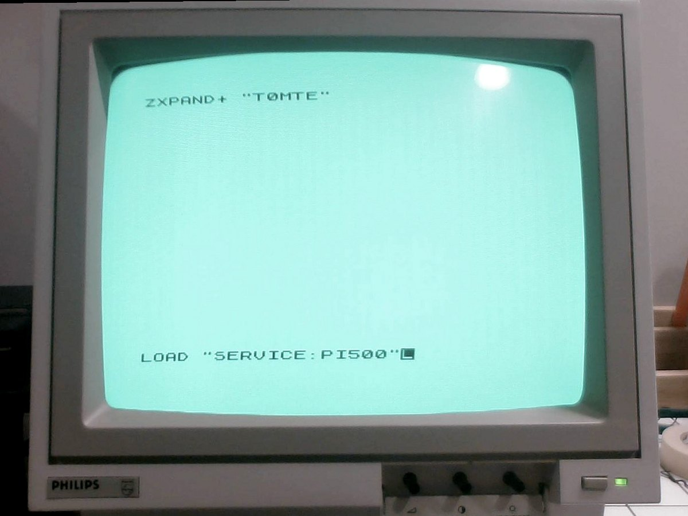
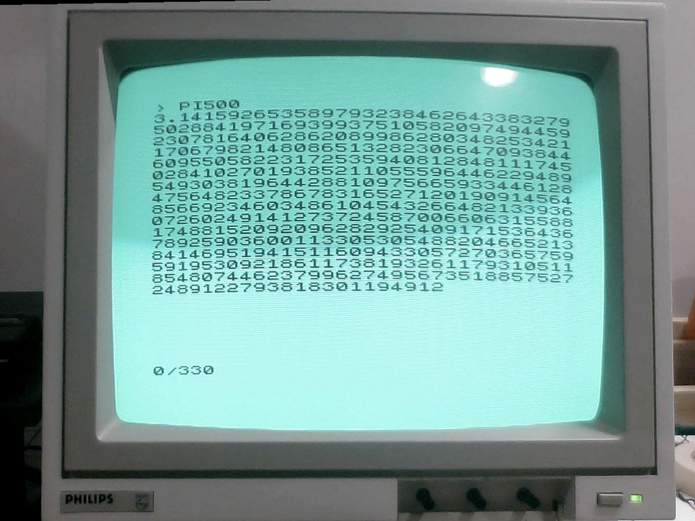
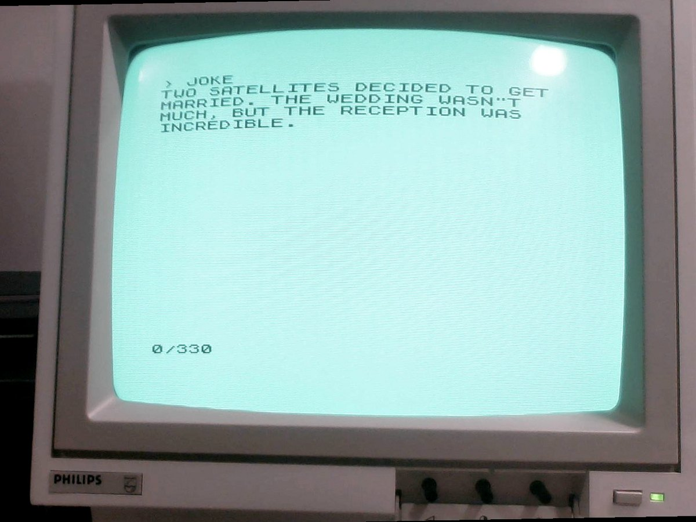

# zedwire

**Dad jokes, 500 digits of pi and the weather, on a ZX81.**

Have you ever wanted your ZX81 to tell you dad jokes? Is the 3.1415927 you
get from `PRINT PI` just not accurate enough? zedwire connects a
**ZX81 with a ZXpand+** to a Mac or Linux machine through the ZXpand+'s
serial port and a cheap USB-serial adapter. Type `LOAD "SERVICE:JOKE"` and a
joke comes back; type `LOAD "SERVICE:PI500"` and you get 500 digits.

<p align="center">
  
  
  
</p>

What's in the box:

- **`SERVICE` + `zxservice.py`**: `LOAD "SERVICE:<keyword>"` on the ZX81
  runs a command on the Mac/Linux side and prints the answer on the ZX81
  screen. Jokes, fortunes, the time, the weather, a calendar, and arithmetic
  to more digits than the ZX81 has ever seen.
- **`zxsvr`**: serves a `.p` file so `LOAD "$"` loads it over serial. A C
  port of Charlie Robson's `zxsvr.cs`.
- **`PINGPONG`** + `zxpong.py`: the smallest two-way test. The ZX81 sends
  `PING` and the computer answers `PONG!`.
- **Notes on the ZXpand+ serial API** ([docs/zxpand-serial.md](docs/zxpand-serial.md)),
  including the port-level receive commands the online manual doesn't cover.
  They were worked out from Charlie's example code and confirmed on real
  hardware.

## What you need

- A ZX81 with a **ZXpand+** running the
  [TOMTE firmware](https://github.com/charlierobson/ZXpand-Vitamins#zxpand-vitamins).
- A **TTL-level** USB-serial adapter (FTDI or similar).
- Three wires: GND, TX, RX, crossed over. See **[docs/wiring.md](docs/wiring.md)**.
- A C compiler for `zxsvr`, and Python 3 for the rest.

## Quick start

```sh
make                       # builds ./zxsvr
cp services.conf.example services.conf
```

Serial device names: on macOS use `/dev/cu.usbserial-*`. On Linux it's
usually `/dev/ttyUSB0`, and you need to be in the `dialout` group
(`sudo usermod -aG dialout $USER`, then log in again).

### 1. Load a program over serial

```sh
./zxsvr game.p /dev/cu.usbserial-XXXX        # add -l to keep serving repeated loads
```

On the ZX81: `LOAD "$"`. `zxsvr` prints every command byte as it arrives,
in hex, and reports a garbled sign-off (see *Known issues*).

### 2. Ping/pong

```sh
./zxsvr pingpong/PINGPONG.P /dev/cu.usbserial-XXXX    # LOAD "$" on the ZX81, then Ctrl-C
./pingpong/zxpong.py /dev/cu.usbserial-XXXX
```

On the ZX81: `RUN`. Expected:

```
GOT 6 BYTES:
80 79 78 71 33 10
PONG?
```

`RUN 400` does the same but sends `PING` with BASIC's `ZXPAND "PUT SER PING"`
— `zxpong` reports whether the bytes arrived as ASCII or ZX81 codes.

### 3. SERVICE

```sh
./zxsvr service/SERVICE.P /dev/cu.usbserial-XXXX      # LOAD "$" on the ZX81, then Ctrl-C
./zxservice.py services.conf /dev/cu.usbserial-XXXX
```

On the ZX81, once: `GOTO 30`. This saves `SERVICE` to the SD card as a
self-starting program, then runs it (it will ask for a keyword; type `TIME`).
Always put SERVICE on the card this way: a `SERVICE.P` copied onto the card
by hand doesn't start by itself, so `LOAD "SERVICE:TIME"` would just stop.
From then on:

```
LOAD "SERVICE:TIME"
LOAD "SERVICE:FORTUNE"
LOAD "SERVICE:WEATHER"
```

The text after the colon is the keyword. `LOAD "SERVICE"` on its own asks
for one.

## zxservice configuration

`services.conf` maps keywords to shell commands, one per line. A few from
[`services.conf.example`](services.conf.example):

```
TIME=date '+%H:%M:%S'
JOKE=curl -s -m 8 -H 'Accept: text/plain' https://icanhazdadjoke.com/

# Services that take an argument use "$1":  LOAD "SERVICE:CALC2**100"
CALC=echo "$1" | bc -l
PI=echo "scale=$1+5; p=4*a(1); scale=$1; p/1" | bc -l
```

The maths services do what the ZX81 can't: its numbers run out at about
9 digits. `CALC2**100` prints all 31 digits, `PI500` gives 500 digits of
pi, `FACT50` gives 50 factorial exactly (65 digits), and `FACTOR600851475143`
gives the prime factors. Write the argument straight after the keyword, with
no space: a space in `LOAD "SERVICE:..."` cuts it off (see *Known issues*).
Typed at SERVICE's own prompt, `PI 50` works too. To type `**`
on the ZX81, press `*` (shift-B) twice. The `**` key (shift-H) enters a
keyword token, which the ZXpand+ turns into `,` and cuts off.

- Keywords are case-insensitive. The keyword **only selects** a command from
  this file — nothing received over serial is ever executed.
- **Arguments:** keywords are letters only, so the argument is everything
  from the first non-letter on (`PI50` → `PI`, `50`). A command
  that uses `"$1"` gets it as a shell positional parameter, never pasted into
  the command text. It may only contain digits, spaces and
  `+ - * / ^ ( ) .`, and `**` becomes `^`. Commands without `$1` ignore any
  argument.
- Commands run in the config file's directory, so `helpers/...` paths work.
- Output is laid out for the ZX81: accents and symbols folded to plain ASCII
  (`Zürich` → `ZURICH`), wrapped to 32 columns, cut to 19 lines.
- Commands time out after 10 seconds. The whole process group is killed then,
  so `CALC9**9**9` can't leave a `bc` running.
- The example's `FORTUNE` uses `fortune -s -n 200 | fmt -w 32` to keep to
  short fortunes and rewrap them (`brew install fortune` on macOS).

Options: `--baud`, `--width`, `--lines`, and `--chunk`/`--pace-ms`, which
control how fast replies are sent (see *Known issues*).

## Repository layout

| Path | What |
|---|---|
| `zxsvr.c` | `LOAD "$"` server (C, POSIX termios, no dependencies) |
| `zxservice.py`, `services.conf.example` | keyword → command server |
| `helpers/` | helper scripts for services (`fact.py`, `factor.py`) |
| `service/` | ZX81 side of SERVICE: `service.asm` (Z80), `service.bas`, `table.inc`, prebuilt `SERVICE.P` |
| `pingpong/` | ping/pong test: `pingpong.asm`, `pingpong.bas`, prebuilt `PINGPONG.P`, `zxpong.py` |
| `tools/mkp.py` | builds a `.p` file from a BASIC text file + a machine-code blob |
| `tools/p2bas.py` | lists the BASIC in a `.p` file |
| `tools/mktable.py` | generates the ASCII → ZX81 character table |
| `tools/simulate.py` | runs the Z80 code in an emulator against a fake ZXpand+ |
| `docs/` | serial API notes, wiring and photos, hardware test checklist |

## Building the ZX81 programs

The `.bin` and `.P` files are committed, so you only need this if you change
the assembly or BASIC:

```sh
make zx        # needs GNU z80asm: brew install z80asm / apt install z80asm
make test      # runs the Z80 code in an emulator, needs the z80 package
```

For `make test`, install the `z80` package in a venv (Homebrew's Python and
recent Debian/Ubuntu refuse a global `pip install`; on Debian/Ubuntu you may
need `apt install python3-venv` first). `make` uses `.venv` automatically:

```sh
python3 -m venv .venv && .venv/bin/pip install z80
```

The machine code sits in a `REM` in line 10, starting at 16514. Neither
program starts by itself when loaded over serial. SERVICE's `GOTO 30` saves
a copy to SD that does.

## Known issues and open questions

What has been tested on real hardware so far is in
[docs/testing.md](docs/testing.md).

- **`LOAD "$"` often ends with a garbled sign-off.** The program loads fine,
  but the final `X` (`58`) arrives damaged, so far as `98` or `D8`, usually
  followed by `FF`. The cause is unknown. `zxsvr` treats a stray byte after
  the whole file has been sent as the sign-off and shows it bit by bit against
  `X`; loop mode (`-l`) counts clean vs garbled sign-offs:

  ```
   . [98]  ?
     Expected the sign-off 'X' here - the whole file has been sent.
     On the wire (start | bit 0 ... bit 7 | stop):
     expected 'X'   58:  0 | 0 0 0 1 1 0 1 0 | 1
     received       98:  0 | 0 0 0 1 1 0 0 1 | 1
                                         ^ ^
     followed by: FF
     Treating it as a garbled sign-off. The load itself should be fine.
  ```
- **ZXpand+ receive buffer size is unknown.** `zxservice` sends replies in
  32-byte chunks with 10 ms gaps to be safe, though a full-screen reply
  (579 bytes) also arrived intact sent in one go. If SERVICE prints
  `(SHORT n/m)`, bytes were lost — try `--pace-ms 20` or `--chunk 16`.
- **No spaces in `LOAD "SERVICE:..."`.** `LOAD "SERVICE:CALC 1/3"` arrives as
  just `CALC`: `LOAD` or `GET PARM` stops at the first space. `PUT SER`
  keeps spaces, so `CALC 1/3` typed at SERVICE's prompt works. Otherwise
  write the argument straight after the keyword: `CALC1/3`.
- `GET SER` (the BASIC receive command) wasn't needed and hasn't been explored.

## Ideas / next steps

- `LOAD "SERVICE:MAZOGS"`-style loading of any program by name: port the
  `I`/`T`/`X` block transfer to Z80 code in the loader, then jump into the
  loaded program.
- Results into variables or memory, not just onto the screen: let a program
  call SERVICE and get the reply back in a string variable, or at a fixed
  address to `PEEK`, so BASIC can use the time, a number or a random word.
- An AI dungeon master: a `QUEST` service where a language model runs a
  short text adventure, a few lines per screen with numbered choices. The
  player answers with a digit (`QUEST2`), so it needs almost no typing on the
  ZX81 keyboard and fits today's digits-only arguments. The server keeps the
  story between calls. Old-school and silly, in the spirit of Zork, Sierra and
  Monty Python: you win or die within a few rounds.

## Credits

- **Charlie Robson (sirmorris)** — the ZXpand and ZXpand+, their firmware,
  and [ZXpand-Vitamins](https://github.com/charlierobson/ZXpand-Vitamins).
  - `zxsvr.c` is a C port of his
    [`serial-server/zxsvr.cs`](https://github.com/charlierobson/ZXpand-Vitamins/tree/master/serial-server),
    with the same `I`/`T`/`X` protocol. The port adds loop mode, clean port
    teardown, hex diagnostics and handling of the garbled sign-off.
  - The port-level serial API used by the Z80 code comes from his
    [`serial-breakout/serialio.c`](https://github.com/charlierobson/ZXpand-Vitamins/blob/master/serial-breakout/serialio.c).
    How `LOAD "NAME:ARG"` arguments are read comes from
    [`midi-play/midiplay.asm`](https://github.com/charlierobson/ZXpand-Vitamins/blob/master/midi-play/midiplay.asm).
  - The [ZXpand online manual](https://github.com/charlierobson/ZXpand-Vitamins/wiki/ZXpand---Online-Manual)
    and the [serial server / `LOAD "$"`](https://github.com/charlierobson/ZXpand-Vitamins/wiki/Serial-Server-and-LOAD-%22$%22)
    wiki pages.
- [SM7I's RetroCom](https://github.com/SM7I/RetroCom) — a ZXpand+ serial
  terminal and MIDI player; proof that this sort of thing works.

## How this was made (AI disclosure)

This project was written with a lot of help from an AI assistant
(Anthropic's Claude). The C port, Python servers, Z80 code, build tools and
these docs were drafted in conversation with it. The wiring, continuity
testing and all hardware testing were done by hand on a real ZX81 and
ZXpand+, and the author decided what went in.

[docs/testing.md](docs/testing.md) lists what has actually been seen working on hardware.
The API notes mark anything inferred or untested as such. Corrections from
people who know the ZXpand+ better are very welcome — open an issue.

## License

MIT — see [LICENSE](LICENSE). Use it, change it, share it.

`zxsvr.c` is derived from `zxsvr.cs` in ZXpand-Vitamins, which has no
explicit license. It is included here with credit, in the spirit of that
project. If the upstream author would like it handled differently, please
open an issue.
