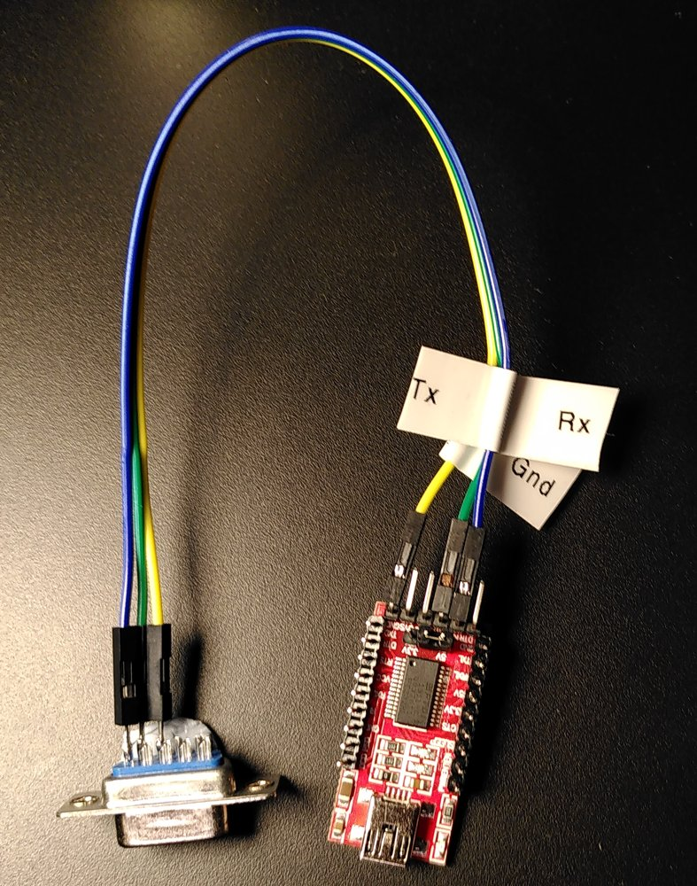
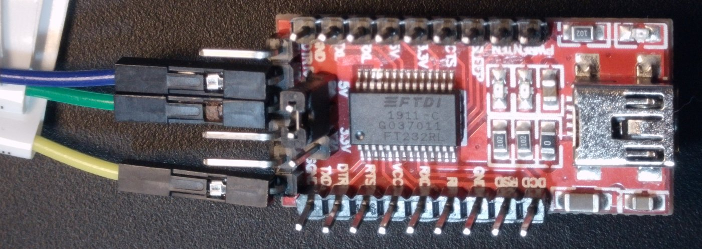
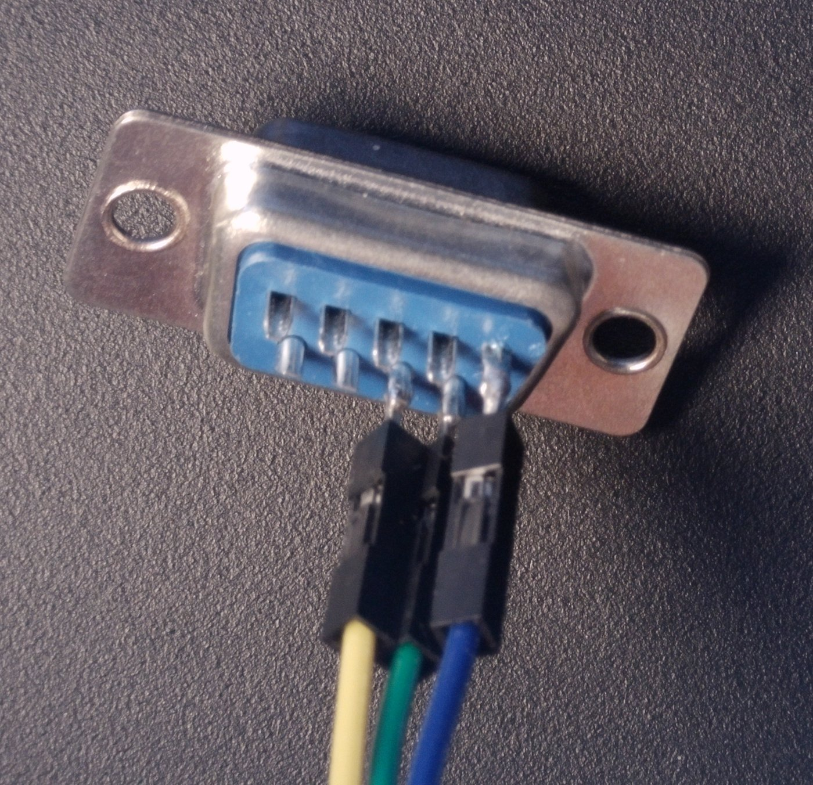

# Wiring

Three wires are needed: GND, and TX/RX **crossed over** (the ZXpand+'s TX
goes to the adapter's RX, and the other way round). Use a **TTL-level**
USB-serial adapter (FTDI FT232 or similar), not an RS-232 port.

## ZXpand+ 10-way connector

The serial pins are on the ZXpand+'s 10-way IDC extension (joystick/serial)
connector. Pin names are from the ZXpand+'s point of view.

| Pin | Signal | | Pin | Signal |
|---|---|---|---|---|
| 1 | Up | | 2 | Fire |
| 3 | Down | | 4 | 5 V |
| 5 | Left | | 6 | **GND** |
| 7 | Right | | 8 | **RX** (data in) |
| 9 | **TX** (data out) | | 10 | 3.3 V\* |

\* Pin 10 carries 3.3 V only on boards before issue 5.2. The
[manual](https://github.com/charlierobson/ZXpand-Vitamins/wiki/ZXpand---Online-Manual)
notes that the joystick interface differs between issue 5.1 and 5.2, but
gives this one pinout for both, apart from pin 10.

## Direct to an FTDI-style adapter

| ZXpand+ | Adapter |
|---|---|
| pin 6 GND | GND |
| pin 8 RX | TXD |
| pin 9 TX | RXD |

Dupont jumpers onto the IDC header work fine. **Confirmed** with continuity
testing and in use.

## Using the ZXpand+'s IDC10-to-DB9 adapter cable

The DB9 adapter that comes with the ZXpand+ is **ZXpand-specific**. It is
not a generic PC COM-port header adapter (neither the AT/Everex nor the
DTK/Intel layout). Continuity-tested:

| DB9 (male) pin | Signal (ZXpand+ side) | Adapter |
|---|---|---|
| 5 | TX | RXD |
| 8 | GND | GND |
| 9 | RX | TXD |

This fits the connector also being a standard Atari/Commodore 9-pin
joystick port: GND on pin 8 matches the joystick pinout, and serial uses
pins 5 and 9, which a joystick doesn't.

## The adapter used here

A cheap red FT232RL board with a 5 V / 3.3 V jumper and a mini-USB socket,
wired to the DB9 adapter cable of an issue 5.1 ZXpand+ with three dupont
jumpers. The
jumper is on **5 V**, which matches the ZXpand+: its
[manual](https://github.com/charlierobson/ZXpand-Vitamins/wiki/ZXpand---Online-Manual)
says the serial port uses 5 V TTL levels. 3.3 V worked too, but 5 V is the
setting to use.

| Wire | Adapter pin | DB9 pin | ZXpand+ signal |
|---|---|---|---|
| blue | RXD | 5 | TX |
| green | TXD | 9 | RX |
| yellow | GND | 8 | GND |

The whole cable, with the DB9 end on the left and the adapter on the right.
The paper flags name the ZXpand+ side of each wire: `Tx` is blue, `Rx` is
green, `Gnd` is yellow.

The adapter's 6-pin end header runs DTR, RXD, TXD, VCC, CTS, GND from top
to bottom in this photo. The labels are hidden under the plugs, but DTR and
GND can just be seen at either end.

The same three wires on the DB9 side:

## Host side

- **macOS:** use `/dev/cu.usbserial-*`. The `/dev/tty.usbserial-*` node can
  block on open, waiting for carrier detect.
- **Linux:** usually `/dev/ttyUSB0`. Add yourself to `dialout`
  (`sudo usermod -aG dialout $USER`) and log in again.
- Quick check without any of these tools, on Linux:
  `stty -F /dev/ttyUSB0 38400 raw -echo && xxd /dev/ttyUSB0`. Then
  `ZXPAND "OPE SER 38400"` and `ZXPAND "PUT SER HELLO"` on the ZX81 should
  show `48 45 4c 4c 4f`.
